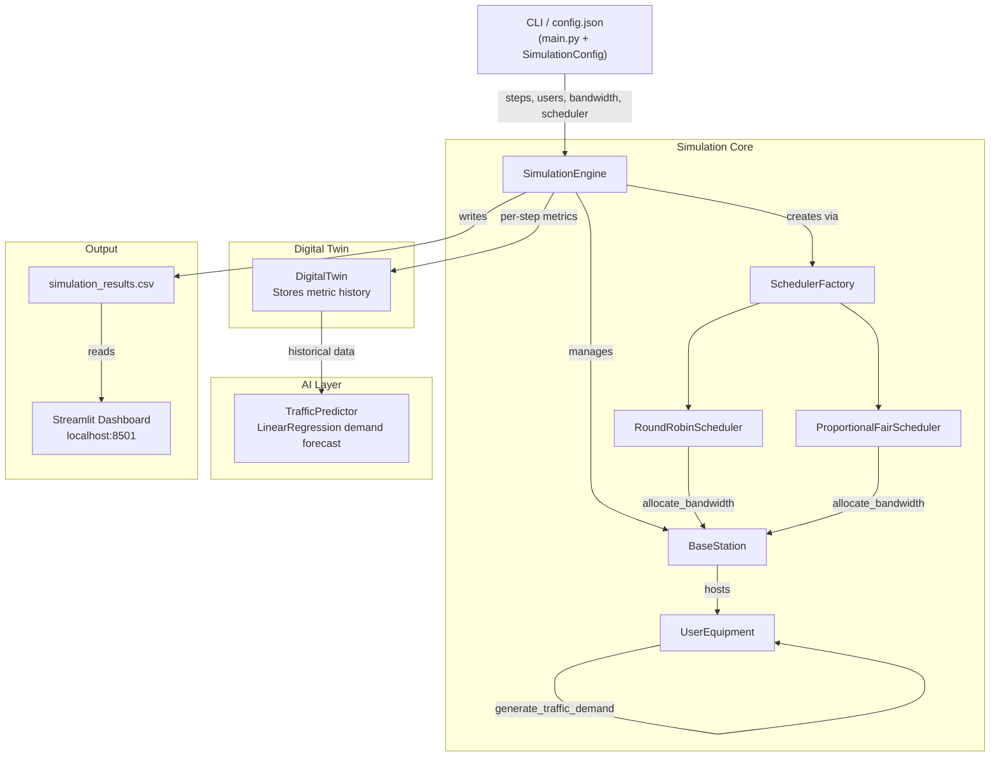

# 5G RAN Digital Twin Simulator

A research-grade Python platform for simulating 5G Radio Access Networks (RAN), exploring scheduling algorithms, AI-based traffic prediction, and interactive dashboard visualization.

---

## Key Features

- Simulates 5G RAN with multiple base stations and user equipment (UE)
- Pluggable scheduler architecture (Round Robin, Proportional Fair, easily extensible)
- Digital twin: maintains virtual network state and history
- AI-based traffic demand prediction (scikit-learn)
- Robust error handling and logging
- Interactive Streamlit dashboard for results visualization
- Flexible configuration via JSON or CLI

---

## Architecture Overview



---

## Installation Instructions

1. **Clone the repository:**
   ```bash
   git clone https://github.com/your-org/5g-digital-twin-simulator.git
   cd 5g-digital-twin-simulator
   ```

2. **Install dependencies:**
   ```bash
   pip install -r requirements.txt
   ```

---

## Running the Simulator

**Default run (using built-in config):**
```bash
python main.py
```

**Custom configuration:**
```bash
python main.py --config path/to/config.json
```

This generates `data/simulation_results.csv` with simulation metrics.

---

## Configuration Example

Create a `config.json` file to customize simulation parameters:
```json
{
  "simulation_steps": 200,
  "users": 30,
  "total_bandwidth_mbps": 150.0,
  "scheduler": "proportional_fair",
  "output_file": "data/simulation_results.csv"
}
```

---

## Dashboard Usage

After running the simulation, launch the dashboard:
```bash
streamlit run dashboard/dashboard.py
```
- Visualizes throughput, demand, and cell load over time.
- Robust to missing or malformed data: shows warnings if results are unavailable.

---

## Scheduler Extensibility

Schedulers implement the `BaseScheduler` interface:
```python
class BaseScheduler(ABC):
    @abstractmethod
    def allocate_bandwidth(self, base_station: 'BaseStation') -> None:
        pass
```
- Add new schedulers by subclassing `BaseScheduler` and registering with `SchedulerFactory`.
- Example: `RoundRobinScheduler`, `ProportionalFairScheduler`.

---

## Logging

- Logs are written to `logs/simulator.log` and output to the console.
- Log level: INFO
- Log format: `%(asctime)s | %(levelname)s | %(name)s | %(message)s`
- Logging is configured via `logging_config.py`.

---

## Example Simulation Output

Terminal summary:
```
--- Simulation Summary ---
Timesteps: 100
Total Users: 20
Average Throughput: 85.23 Mbps
Average Cell Load: 0.92
```
Dashboard: Interactive charts for throughput, demand, and cell load.

---

## Future Work

- User mobility and handover modeling
- Inter-cell interference and advanced radio models
- Additional scheduling algorithms (e.g., Max C/I, ML-based)
- Real-time scenario editing via dashboard
- Integration with real network traces

---
